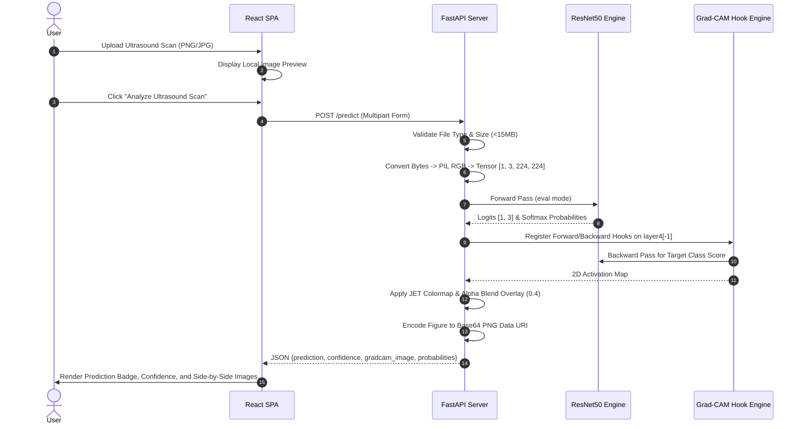

# OncoVision - Project Architecture Specification

This document provides a detailed architectural breakdown of **OncoVision**, an Explainable AI (XAI) framework for 3-class breast ultrasound cancer classification and Grad-CAM attention heatmap generation.

---

## 1. High-Level System Architecture

OncoVision follows a decoupled, modular 3-tier architecture:
1. **Data & ML Core Layer**: PyTorch dataset pipelines, transfer learning model builder (ResNet50), trainer, evaluation modules, and Grad-CAM explainability engine.
2. **REST API Backend Layer**: Asynchronous FastAPI server, singleton model loader, image validation service, and Base64 visualization encoder.
3. **Web Frontend Layer**: React (Vite) single-page application with drag-and-drop upload, real-time prediction badges, confidence scores, and dual-panel visual image comparison.

```mermaid
graph TD
    User["User / Clinical Researcher"] -->|Drag & Drop Image| Frontend["React Frontend (Port 5173)"]
    Frontend -->|POST /predict (Multipart Form)| API["FastAPI Backend (Port 8000)"]
    
    subgraph Backend Services
        API -->|Validate Image & Size| PreprocService["Preprocessing Service"]
        API -->|Singleton Model Access| ModelService["Model Service"]
        API -->|Hook Activation & Gradients| GradCAMService["Grad-CAM Service"]
    end
    
    subgraph Deep Learning Engine
        ModelService -->|Inference Pass| ResNet["ResNet50 Model (models/resnet50_best.pth)"]
        GradCAMService -->|Extract Feature Maps| ResNet
    end
    
    API -->|JSON + Base64 Grad-CAM Image| Frontend
    Frontend -->|Render Prediction & Heatmap| User
```

---

## 2. Directory Structure

```text
OncoVision/
├── dataset/
│   ├── train/                   # Training set (Normal, Benign, Malignant)
│   ├── val/                     # Validation set
│   └── test/                    # Test set
├── models/
│   ├── resnet50_best.pth        # Best model checkpoint based on validation loss
│   └── resnet50_final.pth       # Final model checkpoint at end of training
├── outputs/
│   ├── accuracy_curve.png       # Training vs Validation Accuracy curve
│   ├── loss_curve.png           # Training vs Validation Loss curve
│   ├── confusion_matrix.png     # Test set confusion matrix heatmap
│   ├── sample_verification.png  # Preprocessing verification sample grid
│   └── gradcam_*.png            # Generated Grad-CAM visual heatmaps
├── src/                         # Core Machine Learning Library
│   ├── config.py                # Hyperparameters, paths, and device settings
│   ├── preprocessing/
│   │   ├── dataset.py           # PyTorch BreastUltrasoundDataset & DataLoader factory
│   │   └── transforms.py        # Torchvision train & val/test transform pipelines
│   ├── models/
│   │   └── resnet.py            # ResNet50 model builder & backbone unfreezing logic
│   ├── training/
│   │   └── trainer.py           # 2-Stage training loop, early stopping, LR scheduler
│   ├── evaluation/
│   │   └── metrics.py           # Accuracy, precision, recall, F1, & confusion matrix
│   └── gradcam/
│       └── explain.py           # Grad-CAM hook-based activation map engine
├── backend/                     # FastAPI REST API Backend
│   ├── main.py                  # FastAPI app entry point, CORS, and lifespan manager
│   ├── routes/
│   │   ├── health.py            # GET /health & GET /api/health routes
│   │   └── predict.py           # POST /predict & POST /api/predict routes
│   └── services/
│       ├── model_service.py     # Singleton model loader service
│       ├── preprocessing_service.py # Image upload validation & PIL conversion
│       └── gradcam_service.py   # Heatmap overlay & Base64 PNG encoder
├── frontend/                    # React (Vite) Single-Page Application
│   ├── src/
│   │   ├── App.jsx              # Main dashboard component
│   │   └── index.css            # Medical research slate design stylesheet
│   ├── package.json             # React dependencies
│   └── vite.config.js           # Vite build config
├── scripts/                     # Executable Command Line Tools
│   ├── prepare_busi_dataset.py  # Extract archive.zip & stratified 70/15/15 split
│   ├── verify_dataset.py        # Dataset integrity & MD5 leakage checker
│   ├── test_dataloader.py       # DataLoader tensor shape assertion test
│   ├── evaluate_model.py        # Standalone model test evaluator
│   ├── test_gradcam.py          # Batch Grad-CAM visualization generator
│   ├── test_api.py              # FastAPI integration test suite
│   └── run_full_test_suite.py   # Master 15-test validation suite
├── requirements.txt             # Python dependencies
├── TESTING.md                   # 15-test validation matrix & results
└── README.md                    # Project documentation
```

---

## 3. Data Processing & Inference Pipeline



---

## 4. Design & Security Patterns

1. **Singleton Model Pattern**: `ModelService` loads trained weights (`models/resnet50_best.pth`) into memory once on server startup via FastAPI `lifespan`. No reloading or retraining occurs during incoming API calls.
2. **Data Leakage Guard**: MD5 hashing scans all image files across `train`, `val`, and `test` directories to prevent cross-split contamination.
3. **Headless Thread Safety**: Matplotlib backend explicitly set to `Agg` mode (`matplotlib.use("Agg")`) to guarantee thread-safe server rendering without GUI popups.
4. **Boundary Security**: FastAPI validates image formats (`.png`, `.jpg`, `.jpeg`, `.bmp`, `.tif`), enforces a 15 MB payload limit, and uses CORS middleware (`allow_origins=["*"]`).
