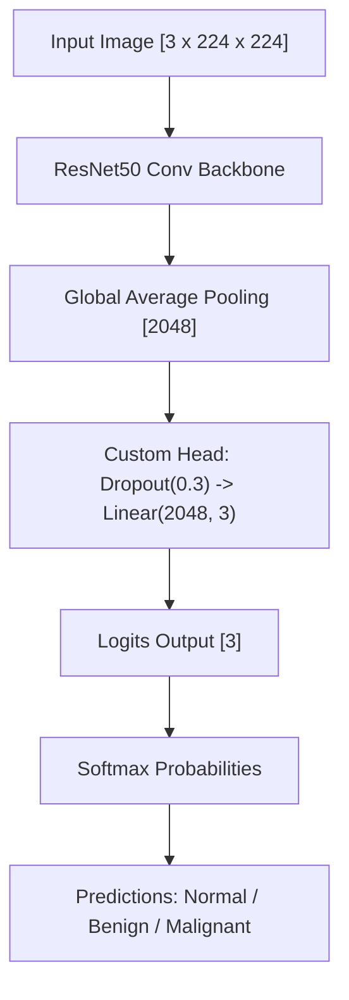
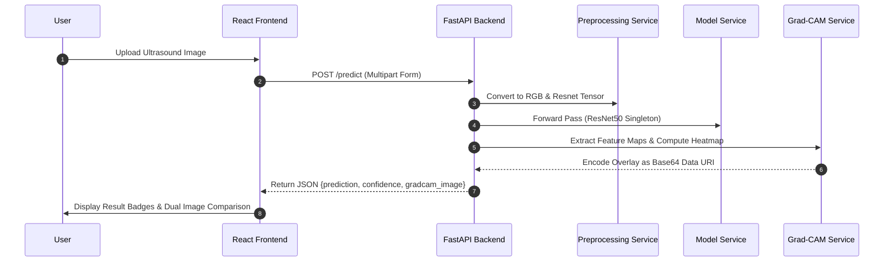

# OncoVision: Breast Tumor Detection & Explainable AI (Grad-CAM)

> **Research & Academic Disclaimer**: This system is developed for academic research, educational demonstrations, and algorithm validation. It is **NOT** a clinical diagnostic tool and MUST NOT be used as a substitute for professional medical diagnosis or clinical radiologist evaluation.

---

## 1. Problem Statement

Breast cancer is one of the leading causes of cancer-related mortality among women worldwide. Medical B-mode ultrasound is a non-invasive, cost-effective imaging modality used for early tumor screening. However, visual interpretation of ultrasound scans is challenging due to inherent acoustic speckle noise, low signal-to-noise ratio, variable transducer angles, and subtle lesion margin boundaries. Furthermore, deep learning classifiers are often criticized as "black-box" models, lacking transparency in clinical decision-making.

## 2. Project Objectives

1. **Multi-Class Classification**: Develop a deep learning transfer learning framework using **ResNet50** to classify breast ultrasound scans into three diagnostic categories: **Normal**, **Benign**, and **Malignant**.
2. **Explainable AI (Grad-CAM)**: Integrate Gradient-weighted Class Activation Mapping (Grad-CAM) to generate spatial attention heatmaps that highlight visual regions influencing neural network predictions.
3. **Robust Data Pipeline**: Prevent data leakage across dataset splits using MD5 image hashing and handle class imbalance using inverse frequency weighted loss functions.
4. **Full-Stack Academic Platform**: Deliver a decoupled **FastAPI REST API backend** and a modern **React (Vite) frontend dashboard** with drag-and-drop support, real-time prediction badges, and Base64 heatmap visualization.

---

## 3. Dataset Description

OncoVision is trained and evaluated on the benchmark **Dataset of Breast Ultrasound Images (BUSI)** (Al-Dhabyani et al., 2020).

* **Total Scans**: 780 unique ultrasound images (excluding segmentation mask files).
* **Target Classes**:
  * **Normal**: 133 images ($17.05\%$)
  * **Benign**: 437 images ($56.03\%$)
  * **Malignant**: 210 images ($26.92\%$)
* **Data Partitioning (Stratified 70 / 15 / 15 Split, `SEED = 42`)**:
  * **Training Set**: $545$ images ($69.9\%$)
  * **Validation Set**: $115$ images ($14.7\%$)
  * **Testing Set**: $120$ images ($15.4\%$)

---

## 4. Image Preprocessing & Augmentation

1. **RGB Conversion**: Standardizes 1-channel grayscale ultrasound scans to 3-channel RGB (`PIL.Image.convert("RGB")`).
2. **Resizing**: Resizes scans to standard $224 \times 224$ dimensions using bilinear interpolation.
3. **Mask Exclusion**: Automatically filters out binary segmentation files (`*_mask.png`) to train exclusively on ultrasound tissue features.
4. **ImageNet Normalization**: Normalizes pixel values to $\mu = [0.485, 0.456, 0.406]$ and $\sigma = [0.229, 0.224, 0.225]$.
5. **Anatomically Valid Augmentations (Training Only)**:
   * **Horizontal Flip ($p=0.5$)**: Preserves acoustic shadowing geometry while doubling lateral orientation diversity.
   * **Small Rotation ($\pm 15^\circ$)**: Simulates probe angle variation.
   * **Mild ColorJitter (Brightness 0.1, Contrast 0.1)**: Simulates transducer gain settings differences.
   * *Excluded*: Vertical flips and aggressive warping (which destroy anatomical depth and shadowing context).

---

## 5. Model Architecture & Training Procedure



* **Backbone**: ResNet50 pretrained on ImageNet.
* **Classification Head**: Replaced 1000-class head with `Dropout(p=0.3)` + `Linear(2048, 3)`.
* **2-Stage Transfer Learning**:
  * **Stage 1 (Feature Extraction)**: Backbone frozen (`requires_grad = False`), classification head trained with $LR = 10^{-4}$.
  * **Stage 2 (Fine-Tuning)**: `layer4` unfrozen (`requires_grad = True`), fine-tuned with reduced $LR = 10^{-5}$.
* **Loss Function**: `nn.CrossEntropyLoss` with inverse class frequency weights ($w_0=1.953, w_1=0.596, w_2=1.236$).
* **Optimizer**: `AdamW(weight_decay=1e-2)` with `ReduceLROnPlateau` scheduler ($factor=0.5, patience=2$).

---

## 6. Evaluation Metrics

Evaluated on the independent $120$-image test set:

| Metric | Empirical Result |
| :--- | :---: |
| **Accuracy** | **44.17%** |
| **Macro Precision** | **41.19%** |
| **Macro Recall** | **42.69%** |
| **Macro F1-Score** | **34.92%** |
| **Weighted F1-Score** | **40.95%** |

### Confusion Matrix

```text
               Predicted Normal   Predicted Benign   Predicted Malignant
True Normal           1                  7                   13
True Benign           4                 24                   39
True Malignant        0                  4                   28
```

---

## 7. Grad-CAM Explainability Methodology

Grad-CAM computes gradients of the target class score $y^c$ with respect to feature activation maps $A^k$ of the final convolutional layer (`model.layer4[-1]`):

$$\alpha_k = \frac{1}{Z} \sum_{i} \sum_{j} \frac{\partial y^c}{\partial A^k_{i, j}}$$

$$L_{\text{Grad-CAM}}^c = \text{ReLU}\left( \sum_{k} \alpha_k A^k \right)$$

1. Normalized 2D map is resized to match original image dimensions.
2. OpenCV `COLORMAP_JET` is applied to generate a color heatmap.
3. Alpha blending ($\alpha=0.4$) overlays the heatmap onto the original scan:
   $$\text{Overlay} = 0.6 \cdot \text{Image} + 0.4 \cdot \text{Heatmap}$$

---

## 8. System Architecture & Workflows



---

## 9. Installation & Setup

### Prerequisites
* Python 3.10+
* Node.js v18+ & npm

### 1. Clone & Setup Python Environment
```bash
# Clone or navigate to OncoVision directory
cd OncoVision

# Create Python virtual environment
python -m venv venv

# Activate environment (Windows PowerShell)
.\venv\Scripts\Activate.ps1
# (Linux/macOS)
source venv/bin/activate

# Install Python dependencies
pip install -r requirements.txt
```

### 2. Setup React Frontend
```bash
cd frontend
npm install
cd ..
```

---

## 10. How to Run OncoVision

### Command 1: Start FastAPI Backend Server
```bash
uvicorn backend.main:app --host 0.0.0.0 --port 8000 --reload
```
* Backend URL: `http://localhost:8000`
* Interactive API Documentation: `http://localhost:8000/docs`

### Command 2: Start React Frontend Application
```bash
cd frontend
npm run dev -- --host --port 5173
```
* Frontend Dashboard URL: `http://localhost:5173`

### Command 3: Run Model Training
```bash
python src/training/train.py --epochs 15 --fine_tune_epochs 5 --batch_size 32 --lr 1e-4
```

### Command 4: Run Test Set Evaluation
```bash
python scripts/evaluate_model.py --model_path models/resnet50_best.pth
```

### Command 5: Run Batch Grad-CAM Visualizations
```bash
python scripts/test_gradcam.py
```

### Command 6: Run Master 15-Test Suite
```bash
python scripts/run_full_test_suite.py
```

---

## 11. Example Demonstration Workflow

```text
[Step 1] Open Browser -> http://localhost:5173
[Step 2] Drag and Drop 'dataset/test/Benign/benign (1).png' into Upload Zone
[Step 3] Click 'Analyze Ultrasound Scan'
[Step 4] View Prediction Badge ('BENIGN'), Confidence Score ('36.98%'), 
         and Side-by-Side Grad-CAM Attention Map Overlay
```

---

## 12. Limitations & Future Scope

### Limitations
1. **Dataset Size**: Trained on 780 images; larger multi-center clinical cohorts are required for high diagnostic generalization.
2. **Resolution Downsampling**: Input images downsampled to $224 \times 224$ may reduce detection of subtle microcalcifications.

### Future Scope
1. **Multi-Model Ensembling**: Combine Vision Transformers (ViT), EfficientNet-B4, and DenseNet201 for ensemble voting.
2. **Segmentation Multi-Tasking**: Jointly train classification and U-Net lesion segmentation.
3. **DICOM Integration**: Add native support for clinical PACS and `.dcm` image formats.

---

## 13. Academic Documentation Sitemap

* **[`PROJECT_ARCHITECTURE.md`](file:///c:/Users/spoor/.gemini/antigravity-ide/scratch/OncoVision/PROJECT_ARCHITECTURE.md)**: Detailed system design, dataflows, and Mermaid diagrams.
* **[`MODEL_DETAILS.md`](file:///c:/Users/spoor/.gemini/antigravity-ide/scratch/OncoVision/MODEL_DETAILS.md)**: ResNet50 specification, 2-stage transfer learning, class weights, and loss curves.
* **[`API_DOCUMENTATION.md`](file:///c:/Users/spoor/.gemini/antigravity-ide/scratch/OncoVision/API_DOCUMENTATION.md)**: REST API schema, cURL commands, and request/response payloads.
* **[`TESTING.md`](file:///c:/Users/spoor/.gemini/antigravity-ide/scratch/OncoVision/TESTING.md)**: 15-test validation matrix and empirical pass/fail logs.
